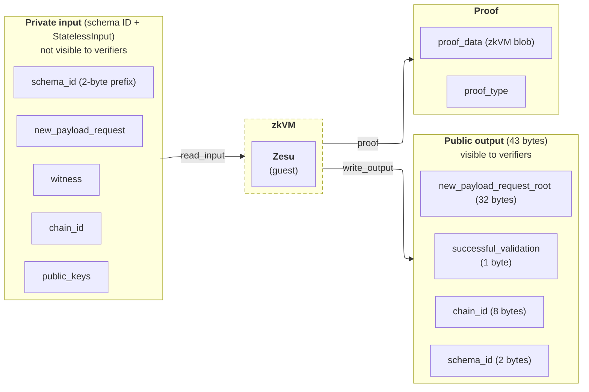

import GlossaryTerm from '@theme/GlossaryTerm'

Zesu runs as a <GlossaryTerm term="Guest program">guest program</GlossaryTerm> inside a <GlossaryTerm term="zkVM">zkVM</GlossaryTerm> and has a defined contract for what it
consumes and what it returns.
That contract is defined by [EIP-8025](https://eips.ethereum.org/EIPS/eip-8025), which proposes optional execution proofs for the
Ethereum consensus layer.
The contract spans three integration points.
Execution clients produce the input, the zkVM loads it into memory where Zesu reads it
directly, and the output feeds the proof that provers generate, distribute, and verifiers
later check.

:::warning
EIP-8025 is in draft status.
The details described here may change as the spec evolves.
:::



## The stateless input

Zesu consumes a single <GlossaryTerm term="SSZ">SSZ</GlossaryTerm>-encoded structure called the stateless input.

```python
class StatelessInput:
    new_payload_request: NewPayloadRequest
    witness: ExecutionWitness
    chain_id: uint64
    public_keys: Tuple[Bytes, ...]
```

The four fields play distinct roles:

- `new_payload_request` is the Engine API payload data supplied by the consensus client.
  It includes the execution payload, blob versioned hashes ([EIP-4844](https://eips.ethereum.org/EIPS/eip-4844)),
  parent beacon block root, and typed execution requests (deposits, withdrawals,
  consolidations, and the builder deposits and builder exits added by
  [EIP-8282](https://eips.ethereum.org/EIPS/eip-8282)).
- `witness` is the chain state Zesu needs to re-execute the payload's transactions without
  holding local state. See [Witness retrieval](./witness-retrieval.mdx) for details.
- `chain_id` identifies the chain the payload belongs to. Zesu treats a `chain_id` of `0`
  as `1` (Ethereum Mainnet).
- `public_keys` optionally contains one 64-byte uncompressed secp256k1 public key
  (no `0x04` prefix) for each transaction signer, in transaction order. When provided,
  the guest uses these keys instead of recovering signers from transaction signatures.

The input is "private" in the proof-system sense. The node running Zesu supplies it, but
verifiers don't see it.
The zkVM proof attests only to the public output described below.

The input carries no fork name.
The schema ID prefix described next tells the guest which fork rules to apply.

### The schema ID prefix

Two bytes precede the SSZ container and identify the input schema:

| Byte | Meaning                                                          |
|------|------------------------------------------------------------------|
| `0`  | `ProtocolFork` index, the fork whose rules the guest must apply  |
| `1`  | Schema revision, how the rest of the payload is encoded          |

The `ProtocolFork` index is the stable fork enum the stateless schemas are keyed by, where
`0x15` is Amsterdam.
Zesu implements every fork in one binary, so it applies the rules the index names instead
of assuming a single fork.
The current schema revision is `0x01`.

Zesu rejects an input whose fork index the enum doesn't define, and any revision other
than `0x01`.
A guest can't execute rules it doesn't have, and the container layout is pinned to the
revision.

## How Zesu receives the input

The wire format for the stateless input is SSZ. How those bytes reach Zesu is up to the
host:

- **zkVM hosts** place the SSZ bytes in a memory-mapped input region the guest reads
  through the `read_input` symbol. See
  [zkVM symbols](../reference/zkvm-symbols.mdx) for the symbol contract.
- **[The native binary](../get-started/install-native.mdx)** reads the SSZ bytes from a file or from standard input. See
  [CLI options](../reference/cli-options.mdx) for the exact flags and precedence.

The native binary additionally accepts a JSON development format (one file for the block,
one for the witness) that deserializes into the same `StatelessInput` structure.
The JSON format is a development convenience for cases where SSZ-encoded inputs are not
available; it is not part of the EIP-8025 contract.

## The validation result

After re-executing the payload, Zesu emits a public output called the stateless validation result.

```python
class StatelessValidationResult:
    new_payload_request_root: Hash32
    successful_validation: boolean
    chain_id: uint64
    schema_id: uint16
```

Zesu serializes this `StatelessValidationResult` as a 43-byte SSZ commitment.
Every field is fixed-size, so the commitment is always 43 bytes.

| Bytes      | Field                      | Description                                      |
|------------|----------------------------|--------------------------------------------------|
| `[0..32]`  | `new_payload_request_root` | SSZ `hash_tree_root` of the `NewPayloadRequest`  |
| `[32]`     | `successful_validation`    | `0x01` for success, `0x00` for failure           |
| `[33..41]` | `chain_id`                 | Chain ID as a little-endian `uint64`             |
| `[41..43]` | `schema_id`                | Input schema ID as a little-endian `uint16`      |

Each field serves a verification role.

- `new_payload_request_root` binds the proof to a specific payload.
- `successful_validation` reports whether block execution succeeded.
- `chain_id` tells the verifier which chain the proof applies to.
- `schema_id` echoes the schema ID the guest decoded, so the verifier knows which fork
  rules and input layout produced the result.

A proof-verifying node accepts the proof only when the proof itself verifies for the
expected guest program, `successful_validation` is `0x01`, and the request root, chain ID,
and schema ID match what the verifier expects.

### Failure outputs

Failure produces one of two different commitments, so don't treat failure as a single
byte pattern.

- **Execution failure**: the input decoded, but the block didn't validate. Zesu emits a
  normal commitment with a real request root, chain ID, and schema ID, and sets
  `successful_validation` to `0x00`.
- **Undecodable input**: Zesu can't decode the SSZ input, so it has no request root or
  schema to report. It emits 43 zero bytes, the
  [`_default_failed_stateless_output`](https://eips.ethereum.org/EIPS/eip-8025#guest-validation)
  defined by EIP-8025. A rejected input must produce exactly these bytes to match the
  reference guest.

## Why the contract matters

Keeping the input private and the output public is what makes stateless verification
possible.
A verifier doesn't need the chain state or the witness to check a proof.
It needs the proof, the public commitment, and a copy of the `NewPayloadRequest` to
verify the binding.

Each integration point relies on a different part of this split.

- **Execution clients** that produce witnesses need to populate every field of the
  stateless input correctly. A malformed witness or mismatched chain ID causes
  the guest to return `successful_validation = false`.
- **zkVM hosts** that run Zesu pass the serialized stateless input as private input and
  surface the 43-byte commitment as public output. The zkVM's symbol ABI for `read_input`
  and `write_output` mediates this exchange.
- **Verifiers** read only the public output and use it to bind a proof to a specific
  payload before treating that proof as evidence of valid execution.
