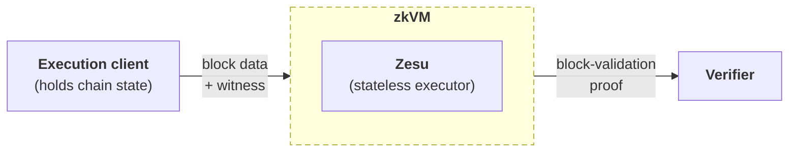

import CardList from '@site/src/components/CardList'
import GlossaryTerm from '@theme/GlossaryTerm'

# Introduction

Zesu is a stateless EVM block executor, written in Zig and designed to run as a <GlossaryTerm term="zkVM">zkVM</GlossaryTerm> guest
program.
It re-executes blocks without holding local chain state and runs inside a zkVM that produces
block-validation proofs that <GlossaryTerm term="Verifier">verifiers</GlossaryTerm> can use to confirm correct block execution without
re-processing any transactions.

## Why Zesu exists

The Ethereum roadmap is moving towards
[zkEVM-based block verification](https://ethereum.org/roadmap/zkevm/), where a single
prover generates a cryptographic proof of block execution that any node can verify cheaply,
without re-executing transactions.

Re-executing every transaction in a block is computationally expensive.
Block-validation proofs offer an alternative: a verifier can confirm correct block execution
by checking a compact cryptographic proof, without re-processing any transactions.

Zesu runs inside a zkVM that produces those proofs.
The same proving capability applies to other networks that require EVM execution proofs.

## How Zesu works

Zesu receives an <GlossaryTerm term="SSZ">SSZ</GlossaryTerm>-encoded block bundle (execution payload and <GlossaryTerm term="Execution witness">witness</GlossaryTerm>) from an <GlossaryTerm term="Execution client">execution
client</GlossaryTerm> that holds the full chain state, then re-executes the block inside a zkVM, which then
produces a proof that the execution was correct.

Zesu also builds as a native binary that runs the same execution logic on your host CPU
without a zkVM, useful for debugging and validating zkVM integrations.

See [Architecture](./concepts/architecture.mdx) for how Zesu fits into the broader pipeline,
and [Witness retrieval](./concepts/witness-retrieval.mdx) for how Zesu obtains the data it
needs.

## Use cases

- **Ethereum L1 zkEVM proving**: Provers run Zesu to prove Ethereum mainnet block execution.
  Provers are a distinct role in the network, separate from validators and block builders.

- **L2 rollups**: L2 networks that require EVM execution proofs can use Zesu as their stateless
  execution client inside a zkVM.

## Next steps

<CardList
  items={[
    {
      href: '/get-started/get-guest-program',
      title: 'Obtain the guest program',
      description: 'Download the Zesu guest program ELF and integrate it into your zkVM host.',
    },
    {
      href: '/get-started/install-native',
      title: 'Install the native binary',
      description: 'Build the native Zesu binary to debug block execution and validate zkVM integrations on your host CPU.',
    },
    {
      href: '/concepts/architecture',
      title: 'Architecture',
      description: 'Understand how Zesu fits into the zkEVM pipeline and how its components interact.',
    },
  ]}
/>
